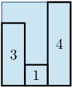
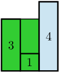
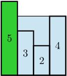
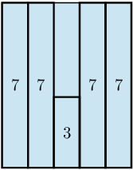

## Cover Buildings
*Given N rectangular buildings of width 1, find the minimum total area of two rectangular banners that cover all of the buildings.*

There are N rectangular buildings standing along the road next to each other. The K-th building is of size H[K] × 1.

Because a renovation of all of the buildings is planned, we want to cover them with rectangular banners until the renovations are finished. Of course, to cover a building, the banner has to be at least as high as the building. We can cover more than one building with a banner if it is wider than 1.

For example, to cover buildings of heights 3, 1, 4 we could use a banner of size 4×3 (i.e. of height 4 and width 3), marked here in blue:

  
We can order at most two banners and we want to cover all of the buildings. Also, we want to minimize the amount of material needed to produce the banners.

What is the minimum total area of at most two banners which cover all of the buildings?

Write a function:

def solution(H)

that, given an array H consisting of N integers, returns the minimum total area of at most two banners that we will have to order.

Examples:

1. Given H = [3, 1, 4], the function should return 10. The result can be achieved by covering the first two buildings with a banner of size 3×2 and the third building with a banner of size 4×1:

2. Given H = [5, 3, 2, 4], the function should return 17. The result can be achieved by covering the first building with a banner of size 5×1 and the other buildings with a banner of size 4×3:

 

3. Given H = [5, 3, 5, 2, 1], your function should return 19. The result can be achieved by covering the first three buildings with a banner of size 5×3 and the other two with a banner of size 2×2:

 

4. Given H = [7, 7, 3, 7, 7], your function should return 35. The result can be achieved by using one banner of size 7×5:

5. Given H = [1, 1, 7, 6, 6, 6], your function should return 30. The result can be achieved by using banners of size 1×2 and 7×4:

Write an efficient algorithm for the following assumptions:

N is an integer within the range [1..100,000];
each element of array H is an integer within the range [1..10,000].