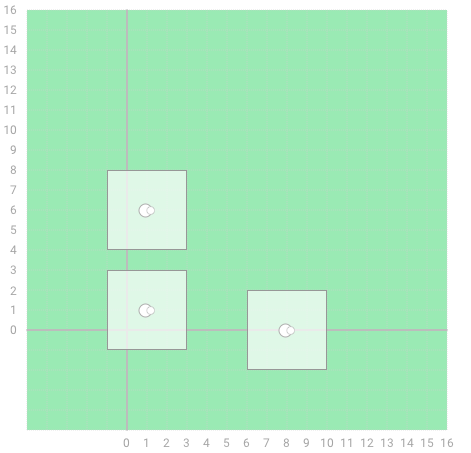

# Exercise
*Given a set of points on a cartesian plane, find the minimum distance between some pair of them to maximise another metric.*  

There are N sheep relaxing in a field. They are positioned at points with integer coordinates. Each sheep has a square sunshade, so as not to overheat. The sunshade of a sheep standing at position (X, Y) spreads out to a distance of D from (X, Y), covering a square whose middle is at (X, Y) and whose sides are of length 2D. More precisely, it covers a square with vertices in points (X − D, Y − D), (X − D, Y + D), (X + D, Y − D) and (X + D, Y + D). Sheep are in the centres of their sunshades. Sunshades edges are parallel to the coordinate axes.

Every sheep spreads out its sunshade to the same width. No two sunshades can overlap, but their borders can touch.

What is the maximum integer width D to which the sheep can spread out their sunshades?

Write a function:

class Solution { public int solution(int[] X, int[] Y); }

that, given two arrays X and Y of length N denoting the positions of the sheep, returns the maximum value of D to which the sheep can spread out their sunshades. There are at least two sheep in the flock, and no two sheep share a point with the same coordinates.

Examples:

1. Given X=[0, 0, 10, 10] and Y=[0, 10, 0, 10],  

the function should return 5.
2. Given X=[1, 1, 8] and Y=[1, 6, 0],  

the function should return 2.

Write an efficient algorithm for the following assumptions:

N is an integer within the range [2..100,000];
each element of arrays X and Y is an integer within the range [0..100,000];
no two sheep are standing in the same position.